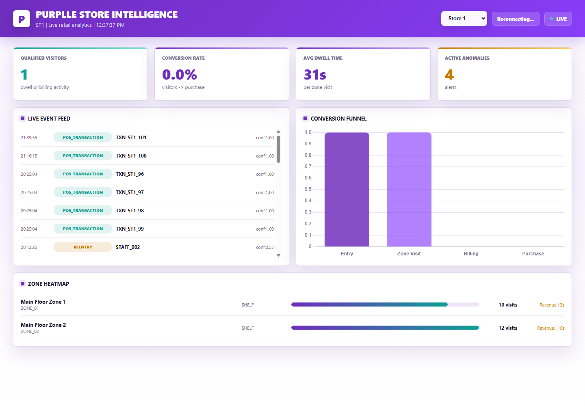
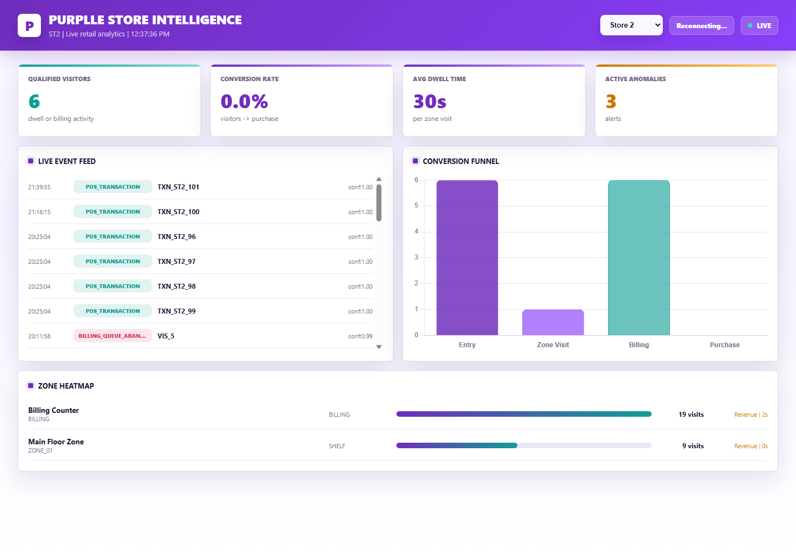

# Store Intelligence API

End-to-end retail analytics pipeline for the Purplle store intelligence challenge: CCTV clips -> structured events -> real-time API metrics -> live dashboard.

## Setup

```powershell
git clone https://github.com/chandrika-prog/retail-cv-pipeline.git
cd retail-cv-pipeline
docker compose up --build
```

Open:

- Dashboard: http://localhost:8000/dashboard
- API docs: http://localhost:8000/docs
- Health: http://localhost:8000/health

## Deploy to Railway

Railway uses `railway.toml` and `Dockerfile.railway` to build a lightweight hosted dashboard/API image. The container listens on Railway's injected `PORT` and automatically seeds the submitted event log plus POS transactions into SQLite.

1. Open [Railway](https://railway.com/) and create a new project.
2. Choose **Deploy from GitHub repo**.
3. Select `chandrika-prog/retail-cv-pipeline`.
4. Wait for the deployment health check at `/health` to pass.
5. In the service settings, open **Networking** and click **Generate Domain**.
6. Open `https://<generated-domain>/dashboard`.

Optional persistent database:

1. Add a Railway volume to the service.
2. Set its mount path to `/data`.

The Railway image already uses:

```text
DATABASE_URL=sqlite:////data/store.db
```

Without a volume, the demo still works and reseeds data after a restart, but runtime changes are not persistent. The Railway deployment serves the pre-generated event log; run the full YOLO/ByteTrack video pipeline locally because the large MP4 challenge files are intentionally not stored in GitHub.

## Submission Notes

This repository contains the application code, tests, Docker setup, store configuration, POS sample, layout images, and sample event loader. The MP4 camera clips are intentionally not committed because several files are larger than GitHub's normal 100 MB file limit. To run full video detection, place the extracted Store 1 and Store 2 MP4 files under `data/challenge` using the same folder names from the challenge dataset.

Mandatory deliverables included:

- `deliverables/final_event_log.jsonl`: generated event log in JSONL format using challenge-style event names and fields
- `README.md`: setup, validation, Docker, and demo instructions
- `DESIGN.md`: architecture, analytics design, staff/re-entry handling, and AI-Assisted Decisions
- `CHOICES.md`: model selection, schema design, API architecture, and AI-Assisted Decisions

Implemented highlights:

- Store 1 and Store 2 dashboard switching
- Live event ingest with WebSocket updates
- YOLO/ByteTrack-based camera event generation
- Uniform-based staff filtering, including Store 2 pink/black uniforms
- POS mapping from legacy `ST1008` transactions to `ST1` and `ST2`
- Funnel, conversion, dwell, heatmap, queue, and anomaly APIs
- Docker and local demo commands
- Pytest coverage for API behavior, store isolation, POS correlation, and staff color detection

## Screenshots

Store 1 dashboard:



Store 2 dashboard:



## Dataset

The current challenge files live under `data/challenge`:

- `Store 1/` and `Store 2/` camera clips and layouts, after extracting the provided dataset locally
- `sample_events.jsonl`
- `pos_transactions.csv`
- `Purplle_Tech_Challenge.pdf`

## Event Log Deliverable

The final generated event log is:

```text
deliverables/final_event_log.jsonl
```

It is produced from detector outputs and uses the same JSONL style as the provided `sample_events.jsonl`: one JSON object per line, with event types such as `entry`, `exit`, `reentry`, `zone_entered`, `zone_exited`, `zone_dwell`, `queue_completed`, and `queue_abandoned`.

Regenerate it after running detection:

```powershell
python export_event_log.py
```

Validate that it is parseable JSONL:

```powershell
python -c "import json; [json.loads(line) for line in open('deliverables/final_event_log.jsonl', encoding='utf-8') if line.strip()]; print('valid jsonl')"
```

## Quick Validation

Load the provided sample events into the running Docker API:

```powershell
docker compose exec api python load_sample_events.py --api http://127.0.0.1:8000/events/ingest
```

Then check:

```powershell
curl http://localhost:8000/stores/ST1076/metrics
curl http://localhost:8000/stores/ST1076/funnel
curl http://localhost:8000/stores/ST1076/heatmap
curl http://localhost:8000/stores/ST1076/anomalies
```

## Run Detection Pipeline

The runner processes the extracted Store 1 and Store 2 clips and streams events to the API:

```powershell
docker compose exec api python run_all_cameras.py --api http://127.0.0.1:8000
```

Outputs are written to `outputs/`. The detector emits raw track counts, uniform staff identities, qualified visitors, and excluded short-pass/staff-like tracks so dashboard numbers are explainable.

Each detection output also writes a sidecar summary file:

```text
outputs/events_store1_entry.summary.json
```

Store-specific detection settings live in:

```text
data/challenge/store_config.json
```

Heatmap zone metadata lives in:

```text
data/challenge/store_layout.json
```

## Load POS Transactions

The POS CSV uses a legacy/anonymized `ST1008` store ID. For this two-store demo, map it explicitly to Store 1 and Store 2:

```powershell
docker compose exec api python load_pos.py --store-id ST1 --api http://127.0.0.1:8000/events/ingest
docker compose exec api python load_pos.py --store-id ST2 --api http://127.0.0.1:8000/events/ingest
```

POS rows are stored as `POS_TRANSACTION` events. A purchase is counted when a non-staff visitor was in the billing queue within the 5 minutes before the transaction.

Load only a time window if needed:

```powershell
docker compose exec api python load_pos.py --store-id ST1 --start 20:10:00 --end 20:12:30 --api http://127.0.0.1:8000/events/ingest
```

## Clean Demo Run

```powershell
python demo.py reset
python demo.py check
```

Start the API:

```powershell
docker compose up --build
```

In a second terminal, run the pipeline and POS loader:

```powershell
docker compose exec api python run_all_cameras.py --api http://127.0.0.1:8000
docker compose exec api python demo.py load-pos --api http://127.0.0.1:8000
docker compose exec api python demo.py smoke --api http://127.0.0.1:8000
```

Use the dashboard dropdown to switch between Store 1 and Store 2.

For local non-Docker commands:

```powershell
python demo.py commands
```

## Demo Video Checklist

1. Start the API and open the dashboard.
2. Show the Store 1 / Store 2 dropdown.
3. Run `run_all_cameras.py` to stream camera-derived events.
4. Run `demo.py load-pos` to map POS transactions into both stores.
5. Show live feed, KPIs, conversion funnel, heatmap, and anomalies updating.
6. Run `python -m pytest -q` or `python demo.py check` to show validation.

## API Endpoints

| Endpoint | Description |
|---|---|
| `POST /events/ingest` | Validates, deduplicates, normalizes, and stores events |
| `GET /stores/{id}/metrics` | Qualified visitors, conversion, dwell, queue, abandonment |
| `GET /stores/{id}/funnel` | Entry -> Zone Visit -> Billing Queue -> Purchase |
| `GET /stores/{id}/heatmap` | Zone visit/dwell intensity, normalized 0-100 |
| `GET /stores/{id}/anomalies` | Dead zones, queue spikes, conversion drops |
| `GET /health` | Service status and stale-feed checks |

## Local Development

```powershell
python -m venv venv
venv\Scripts\activate
pip install -r requirements.txt
cd app
python -m uvicorn main:app --host 127.0.0.1 --port 8001
```

Then use `http://127.0.0.1:8001/dashboard`.

For Store 1 / Store 2 local demo:

```powershell
python run_all_cameras.py --api http://127.0.0.1:8001
python load_pos.py --store-id ST1 --api http://127.0.0.1:8001/events/ingest
python load_pos.py --store-id ST2 --api http://127.0.0.1:8001/events/ingest
```

Then open `http://127.0.0.1:8001/dashboard`.
